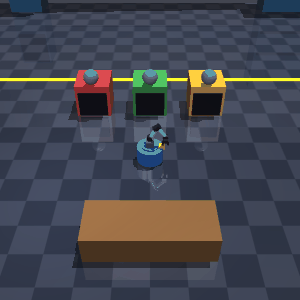

# FeatherSim

A machine-tending autonomy stack **in simulation**, inspired by Feather Robotics: a holonomic
wheeled mobile robot autonomously tends several CNC-style machines. It ships a developer **skill SDK**,
a **perception** model trained on **auto-labeled** sim data, an unattended **autonomy loop**, and a
browser **teleop + telemetry dashboard**. Pure simulation — no real hardware.



*Unattended: the robot perceives which machine is `done`, navigates, unloads it, delivers the part to
the table, and repeats — choosing what to tend from a camera, not from ground truth.*

## Quickstart

```bash
make install     # pip install -r requirements.txt  (Python 3.11+)
make test        # pytest — 94 tests
make demo        # headless autonomy loop, prints live throughput/uptime
make dashboard   # FastAPI teleop/telemetry UI at http://localhost:8000
make train       # retrain the perception CNN on fresh auto-labeled sim data
```

`make demo` output:

```
[t=  9.15s] tended machine_1 → delivered part_machine_1_0 (perceived done @ 98% conf)
[t= 14.88s] tended machine_0 → delivered part_machine_0_0 (perceived done @ 98% conf)
...
Delivered 6 parts in 37.5s sim uptime → 9.6 parts/min
Per machine — machine_0: 2, machine_1: 2, machine_2: 2
```

## What's inside

A walking skeleton built in vertical slices — runnable and demoable at every phase:

| Layer | Package | What it does |
|---|---|---|
| **Sim** | `feathersim/sim/` | Headless MuJoCo world (robot base, parts table, 2–3 machines) + a pure, timer-driven machine FSM `idle→running→done`. Deterministic per seed. |
| **Kinematics** | `feathersim/kinematics/` | Holonomic **mecanum** drive math — pure inverse/forward kinematics, no sim import. |
| **Control** | `feathersim/control/` | Go-to-pose P-controller; the body twist is routed through the wheel IK→FK each tick so the kinematics is load-bearing. |
| **Skill SDK** | `feathersim/sdk/` | A `Robot` facade hiding joints/MJCF/kinematics: `move_to / pick / place / tend`. Preconditions raise `SkillError`. First-class deliverable. |
| **Perception** | `feathersim/perception/` | Renders per-machine camera crops, **auto-labels** them from randomized ground-truth configs, trains a small 2-head CNN. **Held-out state accuracy 1.0 vs a 0.39 majority baseline.** |
| **Autonomy** | `feathersim/autonomy/` | The headline loop: perceive → tend the longest-waiting perceived-`done` machine → repeat, unattended. Selects on **perception, never ground truth**. |
| **Dashboard** | `feathersim/dashboard/` | FastAPI + single-file vanilla JS: live MJPEG feed, per-machine telemetry, **WASD teleop that preempts autonomy** mid-skill. |

## How the loop closes

```
   camera frame ─▶ Perception.perceive ─▶ which machine is *perceived* done?
                                                    │
                                                    ▼
        Robot.tend  ◀──  pick longest-waiting (oldest-first, starvation-free)
        │  move_to(machine) → pick (unload+reload) → move_to(table) → place
        ▼
   part delivered ─▶ throughput / uptime ─▶ (repeat, unattended)
```

The autonomy loop consumes only the perception model's predictions for skill selection — the
perceived-vs-ground-truth split is kept honest end to end (a test makes perception *disagree* with the
sim and asserts the loop follows perception). A perception false positive surfaces as a
`PreconditionError` and is shrugged off; a real navigation failure is left to fail loudly.

The dashboard runs the sim on a single background thread (MuJoCo isn't thread-safe) and re-expresses
autonomy as a tick-based state machine, so a teleop command can **seize manual control mid-skill** and
hand back on release — the carried part and skill state survive the interlude.

## Design decisions

A few choices worth calling out (full log in [`DECISIONS.md`](DECISIONS.md)):

- **MuJoCo, not PyBullet** — PyBullet ships no macOS wheels and its source build fails on Apple
  clang 17; MuJoCo's wheels install instantly, step deterministically headless, and render offscreen.
- **Kinematics & perception logic as pure functions** — testable without spinning up MuJoCo, so the
  bulk of the suite is fast and sim-free.
- **Auto-labeling over hand-labeling** — place the sim in randomized known configs (state × part
  sampled independently for balance) and read labels straight from the config. Zero manual labels.
- **Oldest-waiting-first scheduling** — a `done` machine has stopped cycling, so servicing the
  longest-waiting one is both starvation-free and throughput-maximizing. (The demo caught a fairness
  bug a green unit suite missed — see [`LEARNINGS.md`](LEARNINGS.md).)

## Testing

```bash
make test        # or: python3 -m pytest
```

Kinematics, control, the machine FSM, the SDK, and the autonomy/dashboard control logic are tested as
pure/headless units. Rendering-dependent tests (perception, camera feed) skip automatically on a
headless host without a GL backend — set `MUJOCO_GL=egl` (or `osmesa`) to run them in CI.

## Docs

- [`PLAN.md`](PLAN.md) — phased roadmap + acceptance criteria
- [`DECISIONS.md`](DECISIONS.md) — architecture decision log (why)
- [`LEARNINGS.md`](LEARNINGS.md) — sim/training gotchas, never hit twice
- [`CLAUDE.md`](CLAUDE.md) — conventions + the engineering loop

## Regenerating the demo GIF

```bash
python3 scripts/record_gif.py --parts 3 --out docs/autonomy.gif
```
