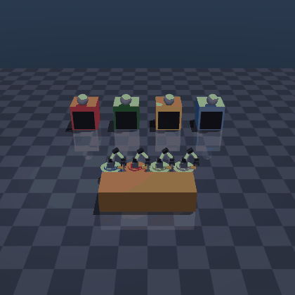

# FeatherSim

A machine-tending autonomy stack **in simulation**, inspired by Feather Robotics: holonomic wheeled
mobile robots autonomously tend several CNC-style machines. It ships a developer **skill SDK**, a
**perception** model trained on **auto-labeled** sim data (hardened with **domain randomization**),
**A\* path planning**, an unattended **single- and multi-robot autonomy** stack, a **behavior-cloned**
controller, and a browser **command center**. Pure simulation — no real hardware.



*Four robots — each with a **3-DOF articulated arm + gripper** — tend four machines on a **factory floor**,
unattended and collision-free (status-light dome = machine state). Each perceives from its own camera, a
fleet manager assigns work without double-booking, A\* plans each path, **ORCA** reciprocal collision
avoidance keeps the busy floor collision-free *and* deadlock-free, and the arms **reach into a machine,
grasp a part, and stack it on the output table**. The command center streams this **live cinematic 3D view**, each robot's **onboard camera**, a
**perception HUD** (what the model sees & infers), and a tactical top-down with paths overlaid — with a
hand-coded↔learned controller toggle and a perception-difficulty slider — at `make dashboard`.*

## Quickstart

```bash
make install     # pip install -r requirements.txt  (Python 3.11+)
make test        # pytest — 183 tests
make demo        # headless single-robot autonomy loop (routes around obstacles)
make fleet       # headless 4-robot fleet, compares scheduling strategies, collision-free
make dashboard   # the command center at http://localhost:8000  (3D feed + onboard cams + paths + toggle + slider)
make teleop      # single-robot dashboard with WASD override
make train       # retrain perception (clean + domain-randomized models)
make policy      # behavior-clone the controller into a learned policy
```

## The stack, layer by layer

A walking skeleton built in vertical slices — runnable and demoable at every phase:

| Layer | Package | What it does |
|---|---|---|
| **Sim** | `feathersim/sim/` | MuJoCo world (1–4 robots with **arm + gripper** and an onboard camera, 1–4 machines, table, obstacles) + a pure timer FSM `idle→running→done`. Cinematic materials/shadows for the live feed; deterministic per seed. |
| **Kinematics** | `feathersim/kinematics/` | Holonomic **mecanum** drive math — pure inverse/forward kinematics, no sim import. |
| **Control** | `feathersim/control/` | Go-to-pose P-controller; the body twist is routed through the wheel IK→FK each tick. Pluggable `velocity_fn`. |
| **Skill SDK** | `feathersim/sdk/` | A `Robot` facade hiding joints/MJCF/kinematics: `move_to / pick / place / tend`. Preconditions raise `SkillError`. |
| **Perception** | `feathersim/perception/` | Renders per-machine crops, **auto-labels** from ground-truth configs, trains a 2-head CNN. The deployed model trains on a **clean+randomized mix**: **1.0 clean *and* 0.94 under domain randomization** (+23 pts over a clean-only model's 0.71; 0.37 baseline). |
| **Planning** | `feathersim/planning/` | Occupancy grid + 8-connected **A\*** + line-of-sight smoothing + a waypoint follower. Routes around obstacles. |
| **Autonomy** | `feathersim/autonomy/` | The single-robot loop: perceive → tend the longest-waiting perceived-`done` machine → repeat. Selects on **perception, never ground truth**. |
| **Fleet** | `feathersim/fleet/` | Multi-robot tick engine (up to 4): task allocation (no double-booking), A\* (static) + **ORCA** reciprocal collision avoidance (collision-free *and* deadlock-free), pluggable scheduling. |
| **Policy** | `feathersim/policy/` | **Behavior-cloned** go-to-pose controller; a tiny MLP drop-in for the P-controller — runs the whole loop at 112% of the expert's throughput. |
| **Dashboard** | `feathersim/dashboard/` | FastAPI + single-file vanilla JS: the multi-robot **command center** (live cinematic 3D feed, per-robot onboard cameras, tactical top-down) and the single-robot **WASD-teleop** dashboard. |

## v2 — five hard systems on top of the walking skeleton

- **Brutal perception.** Domain randomization (randomized lighting, status-light occluders, sensor noise,
  motion blur) makes perception hard; a robust model **holds where the clean one crumbles**.
- **Path planning.** A* on an occupancy grid + a waypoint follower; the robot routes around static
  pillars, body clearance proven on every leg it drives.
- **Multi-robot fleet.** Up to 4 robots, a manager that assigns `done` machines without double-booking, a
  **symmetric contact backstop** + a **stuck-triggered priority-yield deadlock breaker** that keep bodies
  ≥ 2·radius apart *and* the busy floor live (verified collision-free + every-part-delivered over 40 seeded
  4×4/3×3/3×2 runs), and ≥2 scheduling strategies measured for throughput.
- **Learned policy.** Behavior cloning of the hand-coded controller; the learned brain drives the entire
  autonomy loop end-to-end. *(Offline loss didn't predict closed-loop success — a lesson logged.)*
- **Command center.** This dashboard: a **live cinematic 3D feed** of the cell + a tactical top-down with
  planned paths overlaid, per-robot perceived-vs-true state, live task assignments, a **hand-coded ↔
  learned** controller toggle, and a **perception-difficulty slider** that dials domain randomization
  up/down live — drag it and watch the clean model's accuracy drop while the robust model holds.

## v3 — make it look and behave like a real Feather sim

Five polish iterations layered on top, each through the full engineering loop (reviewer SHIP on all five):

1. **Cinematic world + live 3D feed.** Glossy materials, gradient skybox, reflective floor, shadows; the
   command center streams a live 3D overview. Lighting domain randomization is now *relative* to the
   authored key light (the feed stays correctly lit, with no train/serve gap), and the robust model is
   **mix-trained** → robust *without* sacrificing clean accuracy.
2. **Manipulator arms + physical part transport.** Every robot gets an arm + gripper; parts **ride the
   gripper** from machine to a **growing stack on the output table**.
3. **Animated reach / grasp / retract.** The arm **swings into the machine to grasp** and **extends over
   the table to place** — a kinematic, `gravcomp`-decoupled joint that never perturbs the base.
4. **Onboard cameras.** Each robot's **eye-view** — the machine it's tending, its own gripper, the part —
   composited into a live strip in the command center.
5. **A busier 4×4 floor + deadlock-free coordination.** Four robots tending four machines; a
   **stuck-triggered priority-yield deadlock breaker** keeps the contended floor live where the bare
   symmetric backstop would freeze — verified collision-free *and* every-part-delivered across 40 seeds.

## v4 — a real factory floor

Four more iterations to make it genuinely showable, each through the same loop (reviewer SHIP on all four):

1. **3-DOF articulated arms.** The single hinge became a real shoulder→elbow→wrist manipulator with a
   two-finger gripper — it visibly **arcs into the machine to grasp** and extends over the table to place.
   Still kinematically animated, `gravcomp`-decoupled so the base stays exactly static (verified 4e-17).
2. **Factory environment.** Enclosing hall walls + dado, yellow floor safety-lane striping, periphery props
   (pallets, crates, tool cabinet, shelving, safety beacons), reflective industrial floor — all
   non-colliding and outside the work area. Perception retrained on the new look (a constant background is
   uninformative → accuracy *rose* to 0.94 under DR).
3. **Perception HUD — "what the model sees & thinks."** For each machine, the exact domain-randomized crop
   the deployed model received, its inferred state + confidence, and an OK/✗ verdict vs ground truth. Drag
   the difficulty slider and watch crops degrade, confidence drop, and wrong reads flag red in real time.
4. **Graphics polish.** Higher-resolution feeds, a cinematic eye-level overview, metallic reflective arms —
   all perception-safe (close-up crops verified byte-identical, no retrain).

Five specialist subagents (`world-artist`, `manipulation-engineer`, `perception-viz-engineer`,
`frontend-designer`, `render-qa`) in [`.claude/agents/`](.claude/agents) support this arc — `render-qa`
visually inspects every change, `reviewer` audits every diff.

## v5 — ORCA coordination + mission control

- **ORCA reciprocal collision avoidance** ([`feathersim/fleet/orca.py`](feathersim/fleet/orca.py), a faithful
  RVO2 port) replaces the old priority-yield heuristic. **A\*** plans each leg around the *static* world;
  **ORCA** makes the per-tick velocity collision-free against the other robots — smooth, reciprocal, and
  **deadlock-free**. Because planning no longer treats robots as obstacles, the planning deadly-embrace is
  gone too. Every config (incl. the tight pillar cell that used to wedge) completes collision-free at 0.45 m
  across 12-seed sweeps in ~30 s — no slow near-wedge seeds — and runs 23/min steady over a 600 s
  real-perception session. Unit-tested on the classic scenarios (head-on, crossing, antipodal circle, overlap
  recovery, static-obstacle).
- **Live mission log + UI overhaul.** The command center narrates deliveries in real time and got a
  mission-control visual pass (`frontend-designer`).
- **Animated single-robot arm + trajectory trails.** The single-robot loop's arm now visibly reaches in to
  grasp (opt-in `Robot(animate_arm=True)`), and the tactical map draws each robot's fading trajectory trail —
  the smooth ORCA-curved path travelled, distinct from the straight A* plan.

**Benchmark** (`python scripts/bench_fleet.py`, ground-truth perception, 8 seeds/row — the ORCA result):

| config | strategy | completed | collision-free | min sep | mean / max time | throughput |
|---|---|---|---|---|---|---|
| 4m×4r | longest_waiting | 8/8 | ✅ | 0.450 m | 27.5 / 31.1 s | 17.6 / min |
| 3m×3r | longest_waiting | 8/8 | ✅ | 0.450 m | 25.6 / 27.2 s | 14.1 / min |
| 3m×2r + 2 pillars | longest_waiting | 8/8 | ✅ | 0.450 m | 34.6 / 37.0 s | 10.4 / min |

*Every config × strategy completes every seed, collision-free, with no slow near-wedge — the pillar cell
that the old heuristic could wedge now completes cleanly.*

## How the loop closes

```
   camera frame ─▶ Perception.perceive ─▶ which machine is *perceived* done?
                                                    │
                                                    ▼
        Robot.tend  ◀──  assign longest-waiting (fleet: no double-booking)
        │  move_to(machine, plan=A*) → pick → move_to(table) → place
        ▼
   part delivered ─▶ throughput / uptime ─▶ (repeat, unattended, collision-free)
```

Selection consumes only the perception model's predictions — the perceived-vs-ground-truth split is kept
honest end to end (a test makes perception *disagree* with the sim and asserts the loop follows
perception). A false positive surfaces as a `PreconditionError` and is shrugged off; a real navigation
failure fails loudly.

## Engineering rigor

Every phase ran the same loop: smallest vertical slice → `test-runner` (nothing advances on red) →
independent `reviewer` (address CRITICAL/HIGH before commit) → log `DECISIONS`/`LEARNINGS` → commit. The
reviewer caught bugs a green suite hid — a robot body silently clipping a pillar (planning protects the
*center*, the follower bows), a collision guarantee that held only on the lucky seed 0, and a 4-robot
deadlock the bare backstop masked. All are written up in [`LEARNINGS.md`](LEARNINGS.md). **186 tests**;
rendering-dependent tests skip without a GL backend (`MUJOCO_GL=egl`/`osmesa` to run them in CI).

## Docs

- [`PLAN.md`](PLAN.md) — phased roadmap + acceptance criteria (v1 phases 0–6, v2 phases A–E, v3 iterations 1–5, v4 + v5)
- [`DECISIONS.md`](DECISIONS.md) — architecture decision log (why)
- [`LEARNINGS.md`](LEARNINGS.md) — sim/training gotchas, never hit twice
- [`CLAUDE.md`](CLAUDE.md) — conventions + the engineering loop

## Scripts

```bash
python3 scripts/bench_fleet.py --json docs/fleet_bench.json   # fleet coordination benchmark (table above)
python3 scripts/record_fleet_gif.py --out docs/fleet.gif      # the command-center fleet view
python3 scripts/record_gif.py --parts 3 --out docs/autonomy.gif  # the single-robot loop (arm reaches in)
```
